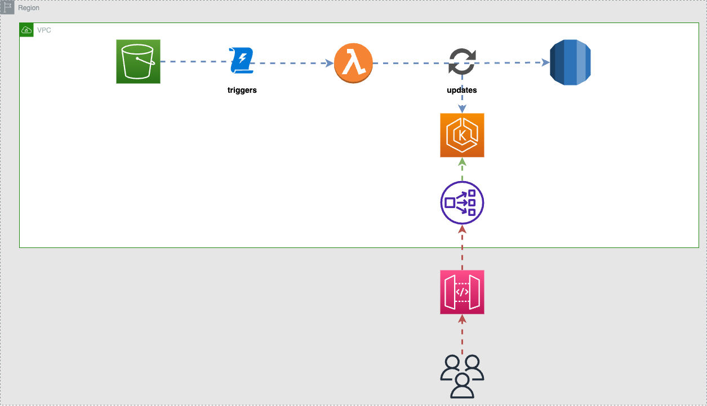
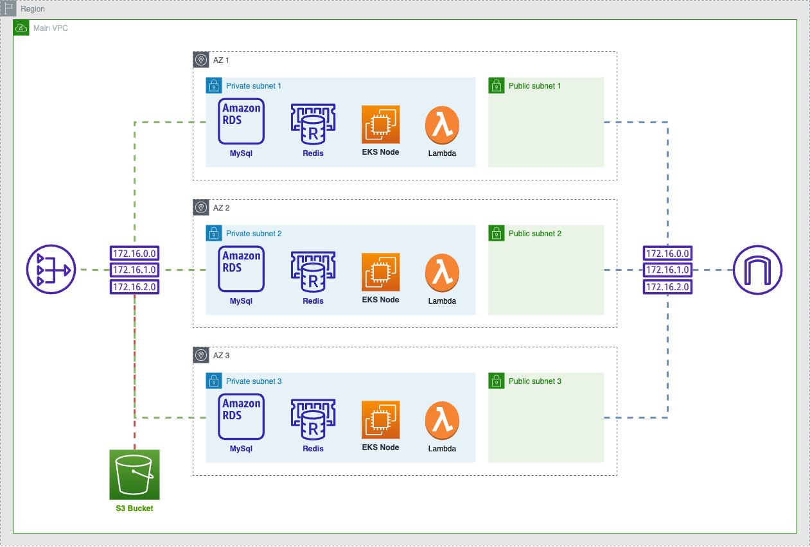
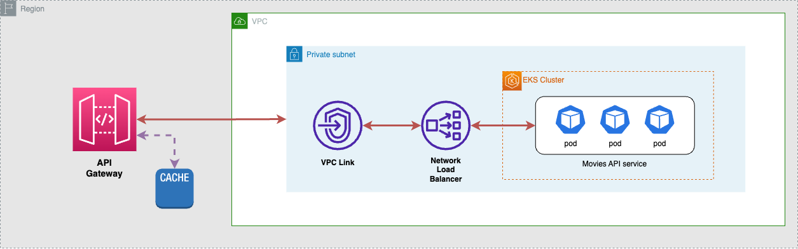

# Solution Overview Document

## Introduction

This document outlines a proposed solution for a robust, scalable, and highly available movie data store. This data store will be accessible via a Restful API and will house data sourced from multiple providers. Our goal is to fulfill the given requirements, which includes a near-real-time response for data queries and perpetual storage for all received data.

## Design

### Data Ingestion
Data providers will send their data updates to AWS S3. Each update event corresponds to a single movie. Updates can occur at any time and there is no limit on the number of updates that can be sent. To process these updates, we will leverage AWS Lambda to trigger on every new object created in the designated S3 bucket, read the update data, and subsequently store it in our database.

### Data Storage
For data storage, we've chosen Amazon RDS MySQL, which is a managed relational database service that provides high availability, security, and compatibility. Given the structured format of our movie data, a relational database like MySQL would provide efficient and reliable data storage and retrieval.

Moreover, to ensure speedy data access and reduce latency, we'll utilize Amazon ElastiCache (Redis) as a caching layer. With this in place, commonly accessed data can be served directly from the cache, significantly reducing data access times.

### API Layer
We'll use Java/Spring Boot for implementing the Restful API given its mature ecosystem, extensive community support, and built-in capabilities for creating enterprise-grade applications.

The API will expose endpoints to query movies by year, movie name, cast member, or genre. Each request will first check the cache layer before proceeding to the RDS database if the data is not found in the cache.

### Deployment and Scalability
The application will be containerized using Docker for easier deployment, versioning, and scalability. These containers will be managed and orchestrated by a Kubernetes cluster deployed on Amazon EKS.

The Kubernetes deployment will be designed to ensure zero downtime and a robust, highly available service. Pods will be spread across multiple availability zones to mitigate potential zone-specific failures.

### Edge Caching
To further reduce latency and achieve a response time within 5ms, we will utilize Amazon API Gateway as a caching layer. This allows us to cache the API responses at edge locations, closer to the end-users, resulting in faster data delivery.

## Diagram

Architecture overview

Components overview

Ingress and caching

## Implementation
The chosen implementation language is Java, but the principles and design choices apply across multiple programming languages and frameworks. The codebase would be managed using Git, allowing version control, collaborative coding, and easy deployment.

## Conclusion
Our solution leverages best-in-class technologies and services to ensure a highly available, robust, and scalable system. We are confident that this design meets all requirements, and are open to further discussion and refinement.

Please note that while this proposal outlines a solid starting point, regular monitoring, performance testing, and tuning would be required to ensure the system continues to meet the 5ms response time as it scales.
